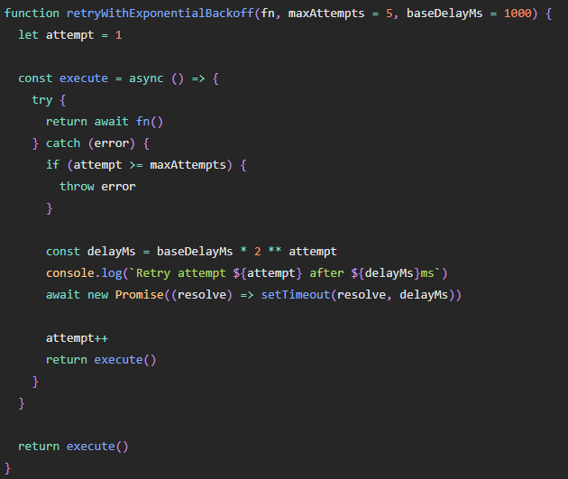
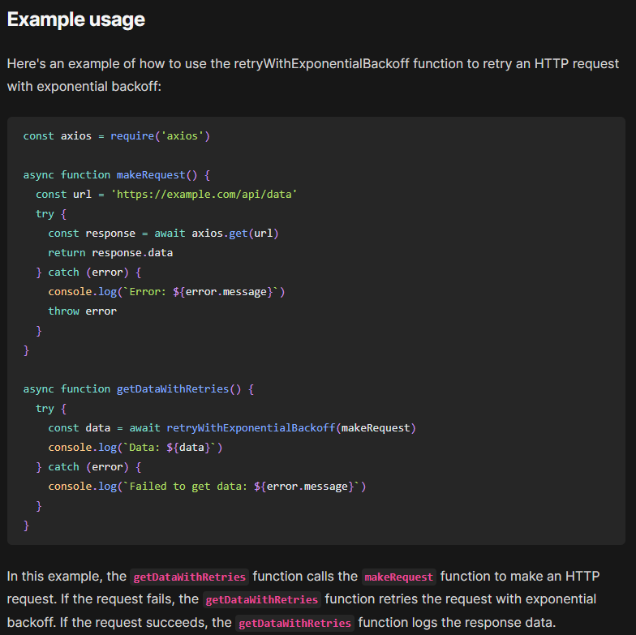

# Retry with Backoff

Retry with exponential backoff is a technique used **to handle network errors by retrying a failed request after waiting for an increasing amount of time between each retry attempt**. This technique is especially useful when dealing with unreliable networks or services that occasionally fail.

If an application detects a failure when it tries to send a request to a remote service, it can handle the failure using the following strategies:

**Cancel**. If the fault indicates that the failure isn't transient or is unlikely to be successful if repeated, the application should cancel the operation and report an exception.

**Retry immediately**. If the specific fault reported is unusual or rare, like a network packet becoming corrupted while it was being transmitted, the best course of action may be to immediately retry the request.

**Retry after delay**. If the fault is caused by one of the more commonplace connectivity or busy failures, the network or service might need a short period while the connectivity issues are corrected or the backlog of work is cleared, so programatically delaying the retry is a good strategy. In many cases, the period between retries should be chosen to spread requests from multiple instances of the application as evenly as possible to reduce the chance of a busy service continuing to be overloaded.

> If the request still fails, the application can wait and make another attempt. If necessary, this process can be repeated with increasing delays between retry attempts, until some maximum number of requests have been attempted. The delay can be increased incrementally or exponentially, depending on the type of failure and the probability that it'll be corrected during this time.

**The application should wrap all attempts to access a remote service in code that implements a retry policy matching one of the strategies listed above. Requests sent to different services can be subject to different policies.**

An application **should log the details of faults and failing operations**. This information is useful to operators. That being said, in order to avoid flooding operators with alerts on operations where subsequently retried attempts were successful, it is best to log early failures as informational entries and only the failure of the last of the retry attempts as an actual error. Here is an example of how this logging model would look like.

If a service is frequently unavailable or busy, it's often because the service has exhausted its resources. You can reduce the frequency of these faults by scaling out the service. For example, if a database service is continually overloaded, it might be beneficial to partition the database and spread the load across multiple servers.

## Impact on performance
The retry policy should be tuned to match the business requirements of the application and the nature of the failure. For some noncritical operations, it's better to fail fast rather than retry several times and impact the throughput of the application. For example, in an interactive web application accessing a remote service, it's better to fail after a smaller number of retries with only a short delay between retry attempts, and display a suitable message to the user (for example, "please try again later"). For a batch application, it might be more appropriate to increase the number of retry attempts with an exponentially increasing delay between attempts.

An aggressive retry policy with minimal delay between attempts, and a large number of retries, could further degrade a busy service that's running close to or at capacity. This retry policy could also affect the responsiveness of the application if it's continually trying to perform a failing operation.

> If a request still fails after a significant number of retries, it's better for the application to prevent further requests going to the same resource and simply report a failure immediately. When the period expires, the application can tentatively allow one or more requests through to see whether they're successful. For more details of this strategy, see the **Circuit Breaker** pattern.

## Idempotency
Consider whether the operation is idempotent. If so, it's inherently safe to retry. Otherwise, retries could cause the operation to be executed more than once, with unintended side effects. For example, a service might receive the request, process the request successfully, but fail to send a response. At that point, the retry logic might re-send the request, assuming that the first request wasn't received.

## Exception type
A request to a service can fail for a variety of reasons raising different exceptions depending on the nature of the failure. Some exceptions indicate a failure that can be resolved quickly, while others indicate that the failure is longer lasting. It's useful for the retry policy to adjust the time between retry attempts based on the type of the exception.

## Transaction consistency
Consider how retrying an operation that's part of a transaction will affect the overall transaction consistency. Fine tune the retry policy for transactional operations to maximize the chance of success and reduce the need to undo all the transaction steps.

## General guidance
Ensure that all retry code is fully tested against a variety of failure conditions. Check that it doesn't severely impact the performance or reliability of the application, cause excessive load on services and resources, or generate race conditions or bottlenecks.

> Implement retry logic only where the full context of a failing operation is understood. 

For example, if a task that contains a retry policy invokes another task that also contains a retry policy, this extra layer of retries can add long delays to the processing. It might be better to configure the lower-level task to fail fast and report the reason for the failure back to the task that invoked it. This higher-level task can then handle the failure based on its own policy.

> Log all connectivity failures that cause a retry so that underlying problems with the application, services, or resources can be identified.

Investigate the faults that are most likely to occur for a service or a resource to discover if they're likely to be long lasting or terminal. If they are, it's better to handle the fault as an exception. The application can report or log the exception, and then try to continue either by invoking an alternative service (if one is available), or by offering degraded functionality. For more information on how to detect and handle long-lasting faults, see the Circuit Breaker pattern.

## When to use this pattern
Use this pattern when an application could experience transient faults as it interacts with a remote service or accesses a remote resource. These faults are expected to be short lived, and repeating a request that has previously failed could succeed on a subsequent attempt.

This pattern might not be useful:

When a fault is likely to be long lasting, because this can affect the responsiveness of an application. The application might be wasting time and resources trying to repeat a request that's likely to fail.
For handling failures that aren't due to transient faults, such as internal exceptions caused by errors in the business logic of an application.
As an alternative to addressing scalability issues in a system. If an application experiences frequent busy faults, it's often a sign that the service or resource being accessed should be scaled up.
Workload design
An architect should evaluate how the Retry pattern can be used in their workload's design to address the goals and principles covered in the Azure Well-Architected Framework pillars. For example:

### Pseudocode

1. Call the target method
2. Handle the response, if successful then return the response and proceed further
3. If method throws exception, wait for delay (delay in ms = attemptNumber x baseDelay) and retry calling the method again, and increase the attempt count, repeat steps from 1 until number attempts reaches upto the max count.

### Reuse method Handler

### Reference
- [How to Implement Retry with Exponential Backoff in Node.js](https://www.codewithyou.com/blog/how-to-implement-retry-with-exponential-backoff-in-nodejs)
- https://aws.amazon.com/blogs/architecture/exponential-backoff-and-jitter/
- https://learn.microsoft.com/en-us/azure/architecture/patterns/retry